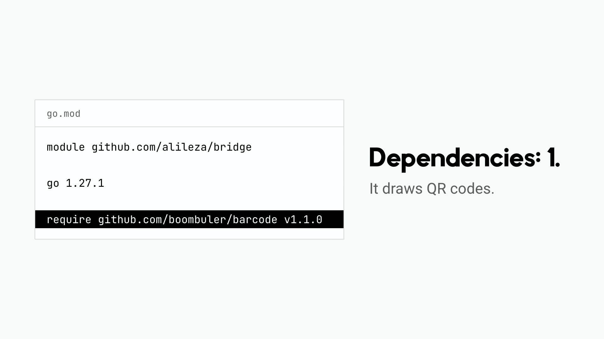

# Bridge 


<a href="docs/brag.mp4"></a>

<sub>▶ Click to watch bridge in 23 seconds (sound on).</sub>


Bridge is a lightweight URL shortener server designed for simplicity, ease of operation, and minimal operational costs. With its minimalist design and efficient architecture, Bridge offers a straightforward solution for shortening URLs without the overhead of complex systems.

## Key Features 

- **Minimalist Design:** Bridge is built with simplicity in mind, offering essential features without unnecessary bloat.
  
- **Easy to Operate:** Setting up and managing Bridge is effortless, making it ideal for both beginners and experienced users alike.
  

## Getting Started 

To deploy Bridge and start shortening URLs, follow these simple steps:


```sh
$ go install .

$ bridge
2024/03/20 05:09:29 Storage: error reading file: open ./bridgedata/routes.json: no such file or directory
2024/03/20 05:09:29 Storage: creating new file: ./bridgedata/routes.json
portal: 2024/03/20 05:09:29 Listening on 0.0.0.0:8080
```

### In action


https://github.com/alileza/bridge/assets/1962129/e3da4868-2a72-40ae-876a-69560364d5a5


## Configuration

| Flag | Env | Default | Description |
| --- | --- | --- | --- |
| `--listen-address`, `-l` | `LISTEN_ADDRESS` | `0.0.0.0:80` | HTTP listen address |
| `--storage-dir`, `-s` | | `./bridgedata` | Routes are stored in `<storage-dir>.json` |
| `--metrics`, `-m` | `METRICS_ENABLED` | `false` | Expose Prometheus metrics at `/metrics` |
| `--metrics-address` | `METRICS_ADDRESS` | | Serve `/metrics` on a separate address instead (e.g. `0.0.0.0:9090`), keeping it off the public port |

`GET /healthz` returns `200` while the route storage is readable, `503` otherwise.

## GitHub login & audit log

Set `--github-client-id` and `--github-client-secret` to require GitHub login for the portal UI and API. Short-link redirects stay public.

1. Create a [GitHub OAuth App](https://github.com/settings/applications/new) with the callback URL `https://<your-bridge-host>/auth/callback`.
2. Run bridge with the app's credentials and decide who may log in:

```sh
bridge \
  --github-client-id "$GITHUB_CLIENT_ID" \
  --github-client-secret "$GITHUB_CLIENT_SECRET" \
  --github-allowed-orgs my-org \
  --session-secret "$(openssl rand -hex 32)"
```

| Flag | Env | Description |
| --- | --- | --- |
| `--github-client-id` | `GITHUB_CLIENT_ID` | OAuth App client ID; enables login |
| `--github-client-secret` | `GITHUB_CLIENT_SECRET` | OAuth App client secret |
| `--github-allowed-orgs` | `GITHUB_ALLOWED_ORGS` | Comma-separated orgs whose members may log in |
| `--github-allowed-users` | `GITHUB_ALLOWED_USERS` | Comma-separated usernames who may log in |
| `--session-secret` | `SESSION_SECRET` | Signs session cookies; set it so logins survive restarts |
| `--github-url` | `GITHUB_URL` | GitHub Enterprise Server base URL (default `https://github.com`) |

If neither allowlist is set, **any** GitHub user can log in (bridge logs a warning).

Every create, update and delete is appended to `<storage-dir>.audit.jsonl` (JSON Lines) with who did it, their verified GitHub emails, when, and the old and new URL:

```json
{"time":"2026-09-23T21:07:00Z","actor":"alice","actor_emails":["alice@acme.com","alice@personal.dev"],"action":"update","key":"go.acme.com/gh","url":"https://github.com/acme","previous_url":"https://github.com"}
```

Bridge requests the `user:email` scope to read verified emails (primary first; unverified ones are ignored). It's shown in the portal's **Activity** tab and on each route, and available at `GET /api/audit?limit=100&key=<host/path>`. Without GitHub login, changes are recorded as `anonymous`.

## Monitoring

With `--metrics` (or `--metrics-address`), bridge exposes Prometheus metrics with no extra dependencies:

- **Activity:** `bridge_redirects_total{host}`, `bridge_routes_forwarded_total{key}`, `bridge_redirect_misses_total{host}`, `bridge_route_changes_total{op}`
- **Health:** `bridge_storage_up`, `bridge_routes{host}`, `bridge_storage_errors_total{op}`, `bridge_build_info{version}`, `bridge_start_time_seconds`
- **HTTP:** `bridge_http_requests_total{handler,code}`, `bridge_http_request_duration_seconds{handler}`
- **Runtime:** `go_goroutines`, `go_memstats_heap_alloc_bytes`, `go_memstats_sys_bytes`, `go_gc_cycles_total`

A ready-made Grafana dashboard lives in [`contrib/grafana/bridge-dashboard.json`](contrib/grafana/bridge-dashboard.json). Import it and pick your Prometheus data source.

## Testing

```sh
make test   # unit tests
make e2e    # black-box tests with tomato
```

The end-to-end suite in [`e2e/`](e2e) uses [tomato](https://github.com/tomatool/tomato). It starts the real bridge binary and drives it over HTTP. `e2e/tomato.yml` covers short links, per-host routing, the portal, the audit log and metrics. `e2e/tomato.auth.yml` runs bridge with GitHub login against a mocked GitHub (OAuth + API), covering org allowlists, sessions and attribution. CI runs both on every pull request.

## Releasing

Every merge to `main` cuts a release automatically: a semver tag, a GitHub release with binaries, and a `ghcr.io/alileza/bridge` image.

- Default bump is **patch**; add the `minor` or `major` label to the PR to bump further.
- Put `[skip release]` in the merge commit message to skip a release.
- To release manually, run the **Release** workflow from the Actions tab and pick the bump.

## Contributing 

Contributions to Bridge are welcome! Whether it's bug fixes, feature enhancements, or documentation improvements, feel free to submit pull requests or open issues on the GitHub repository.

## Feedback and Support 📧

For any questions, feedback, or support inquiries, please don't hesitate to reach out through GitHub Issues or contact us directly at [bridge@alileza.me](mailto:bridge@alileza.me).

Start shortening your URLs effortlessly with Bridge today!
